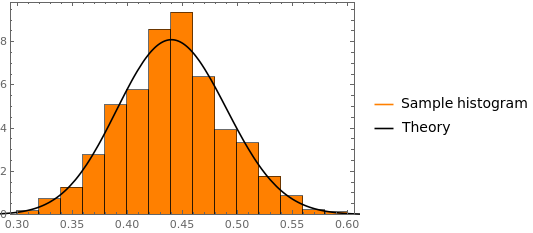

---
title: MathematicaStan, a Mathematica package to interact with Stan
tags:
  - Mathematica
  - Stan 
  - Probabilistic Programming
  - Bayesian
authors:
  - name: Vincent Picaud
    affiliation: 1
affiliations:
 - name: LEMA (CEA, LIST) - Laboratoire architecture Électronique, Modélisation et Analyse de données
   index: 1
date: 15 March 2024
bibliography: paper.bib

--- 

# Summary

MathematicaStan [@picaud18_mathem_mathem_stan] is an interface to
`CmdStan`, the command line interface to Stan. It integrates the power
of the probabilistic programming language Stan [@gelman15_stan]
seamlessly into the Mathematica environment. Probabilistic programming
has gained significant traction in various fields for its ability to
model complex systems and make probabilistic inferences. Stan, offers
an efficient and robust platform for Bayesian inference. Mathematica,
a comprehensive computational tool, provides a rich environment for
symbolic computation and visualization. MathematicaStan bridges the
gap between these two powerful tools, allowing users to harness the
capabilities of Stan within Mathematica's familiar interface.

# Statement of need

The development of MathematicaStan was necessitated by the absence of
an interface with Mathematica within the existing ecosystem of Stan
wrappers. Although several interfaces for Stan existed, including
those for R, Python, shell, MATLAB, Julia, and Stata, there was a
notable gap in connectivity with Mathematica. MathematicaStan was
developed to address this gap.

# State of the field

The landscape of probabilistic programming languages, exemplified by
Stan, is characterized by a growing recognition and adoption across
various fields. These languages offer a powerful framework for
modeling complex systems and conducting probabilistic inference,
thereby enabling researchers and practitioners to address a wide range
of problems. Stan, in particular, has emerged as a prominent player in
this domain. Its expressive syntax and advanced sampling algorithms
make it exceptionally well-suited for tackling complex statistical
models and performing accurate inference. The extensive documentation,
active user support, and vibrant community greatly enhance Stan's
appeal and utility (see [Learn to use
Stan](https://mc-stan.org/users/documentation/tutorials), [Stan
forum](https://discourse.mc-stan.org/)). As a result, Stan is playing
an increasingly vital role in modern data analysis, scientific
research, and decision-making processes.


# Features

Key features of MathematicaStan include seamless integration with
Mathematica's plotting and data manipulation functions, facilitating
the exploration and visualization of model results. Furthermore,
Mathematica's extensive mathematical capabilities complement Stan's
probabilistic modeling, offering a comprehensive environment for
Bayesian analysis and modeling.

MathematicaStan allows users to specify Bayesian models directly
within Mathematica notebooks. The interface seamlessly manages the
compilation and execution of Stan models, facilitating the use of
efficient sampling algorithms for posterior inference:

- full Bayesian statistical inference with MCMC sampling  (NUTS, HMC) 

- approximate Bayesian inference with variational inference (ADVI)

- penalized maximum likelihood estimation with optimization (L-BFGS)

After sampling, users can load and manipulate the samples using all
the functionalities provided by Mathematica, including the creation of
graphical plots.

# Pedagogical example

A comprehensive tutorial is available on the project's [GitHub
page](https://github.com/stan-dev/MathematicaStan), offering a
step-by-step guide to linear regression. It not only walks through the
example but also illustrates how to adjust options, use various Stan
methods, and load generated data for further analysis. This tutorial
provides an excellent opportunity for users to thoroughly familiarize
themselves with MathematicaStan while exploring its core features.

Here, we present a straightforward example to demonstrate how to use
`MathematicaStan`. Imagine we're conducting an experiment where we
flip a biased coin and aim to estimate the probability $p$ of getting
heads. The outcome of each flip, $X \in \{0,1\}$, follows a Bernoulli
distribution, with $X=1$ representing a heads result. In a Bayesian
framework, instead of assuming a fixed value for $p$, we treat $p$ as
a random variable. For simplicity, we assume that $p$ follows an
uniform distribution over the interval $[0,1]$.


$$ p \sim \mathcal{U}([0,1]) $$
$$ X \sim \text{Bernoulli}(p) $$ 

The first step is to translate this problem into the Stan language
(see [Stan
blocks](https://mc-stan.org/docs/reference-manual/blocks.html) for
further details concerning Stan programs).

The data is an array containing our experiment result. A sequence of
$0$ or $1$ obtained after having flipped the coin $N$ times:

```stan
data { 
  int<lower=0> N; 
  array[N] int<lower=0, upper=1> X;
} 
``` 

Here the parameter block is reduced to an unique real number $p \in
[0,1]$. The parameters are the quantities that are sampled by Stan.

```stan
parameters {
  real<lower=0, upper=1> p;
}
```
The model is 
```stan
model {
  p ~ uniform(0, 1);
  X ~ bernoulli(p);
}
```

Now we use MathematicaStan as a way to interact with Stan. Under
Mathematica, you must first load the package:

```mathematica 
<<CmdStan`
```
Then save the Stan program
```mathematica 
stanCode = "
data { 
  int<lower=0> N; 
  array[N] int<lower=0, upper=1> y;
} 

parameters {
  real<lower=0, upper=1> p;
}

model {
  p ~ uniform(0, 1);
  X ~ bernoulli(p);
}";

stanCodeFile = ExportStanCode["my_program.stan", stanCode]
``` 

After creating the program file `my_program.stan`, you need to compile
it:

```mathematica 
stanExeFile = CompileStanCode[stanCodeFile]
```

This operation, transforms the Stan program into a C++ code which is
then compiled to get an executable `my_program` (or `my_program.exe`
for Windows users).

To use this executable, you need to create an input data file. In this
example, we will simulate 100 flips of a biased coin, where the
probability of heads is $p = 0.4$.

```mathematica
n = 100; p = 0.4;
SeedRandom[1234]
stanData = <|"N" -> n, 
   "X" -> RandomVariate[BernoulliDistribution[p], n]|>;
```

which generates these input samples ($44$ heads, $56$ tails):

```
{1, 0, 0, 0, 0, 1, 0, 0, 0, 1, 1, 0, 0, 1, 0, 0, 1, 0, 1, 0, 0, 1, 1, \
1, 0, 1, 1, 0, 0, 0, 1, 0, 0, 1, 0, 1, 1, 0, 1, 0, 1, 1, 1, 0, 1, 1, \
1, 0, 1, 0, 1, 0, 0, 1, 1, 0, 1, 0, 0, 0, 1, 0, 1, 1, 1, 0, 0, 1, 0, \
1, 0, 0, 1, 0, 0, 0, 0, 0, 1, 1, 1, 0, 1, 0, 0, 0, 0, 0, 0, 0, 0, 1, \
1, 1, 1, 0, 0, 1, 0, 0}
```

To save these input samples in order to use them to infer $p$, you
must execute this command that will create the `my_program.data.R`
data file.

```mathematica
stanDataFile = ExportStanData[stanExeFile, stanData]
```

You are now ready to run the previously generated executable. We have
selected the HMC sampler to draw samples of $p$ values.

```mathematica
stanResultFile = RunStan[stanExeFile, SampleDefaultOptions]
``` 

This command will generate a `my_program.csv` file containing the
generated $p$ samples (here $1000$ by default). To import this file
and retrieve these values, type:

```mathematica
stanResult = ImportStanResult[stanResultFile]
pSample = GetStanResult[stanResult, "p"]
``` 

At this point you can use all the regular Mathematica functionalities
to analyze these samples:

```mathematica
Mean[pSample]              (* prints 0.441794 *)
StandardDeviation[pSample] (* prints 0.047756 *)
```

You can also draw the histogram of the samples. For this basic problem
we also know the analytical expression of the posterior. Using the
fact that the Beta distribution is a conjugate prior to the Bernoulli
distribution (see [@fink97_compen_conjug_prior]) one can show that the
posterior distribution is $$ p \mid X \sim \text{Beta}(1+44,1+56) $$
where our prior for $p$ was $\mathcal{U}([0,1])=\text{Beta}(1,1)$. The
input data contains $44$ heads and $56 = 100 - 44$ tails. These
quantities are used to define our posterior distribution
parameters. We can now plot the histogram superimposed with the
theoretical posterior:


```mathematica
p = Show[Histogram[pSample, Automatic, "PDF", Frame -> True, 
    ChartStyle -> Orange], 
   Plot[PDF[posteriorDist, p], {p, 0.01, 1}, PlotStyle -> Black, 
    PlotRange -> All, PlotLabels -> {"True"}]];
Legended[p, 
 LineLegend[{Orange, Black}, {"Sample histogram", "Theory"}]]
```

You get this figure (as a reminder the true $p$ value used to generate
the $100$ input samples was $p=0.4$).

{ width=70% }


# Acknowledgements

We acknowledge contributions from Jonah Gabry, Jeff Patterson, Ali
Ghaderi.

# References


